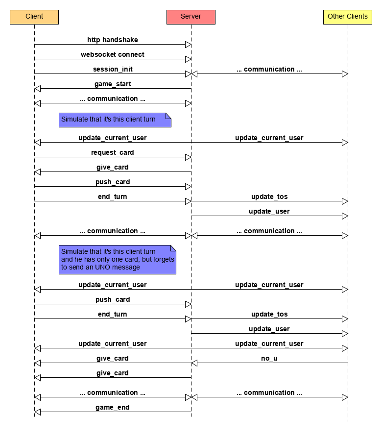

# Uno Server Protocol

## Card IDs

Each card has an ID in the form:

```
<color>/<card_name>
```

where `<card_name>` is one of:

```
one two three four five six seven eight nine block switch plus_two plus_four color_change
```

and `<color>` is one of:

```
red yellow green blue black
```

where the only cards allowed to be `black` are `plus_four` and `color_change`. These cards can only be `black`. 

e.g.

```
red/one black/plus_four yellow/block
```


## Protocol Definition

the messages are send in `JSON` format over Websocket connections, which are established once the user connects to the site. The Packets are `JSON`-Objects with a `type` field to represent misc. message types (e.g. `game_start`, `card_placed`, etc). Players are referenced by their chosen names.

### General Messages

#### Packet `session_init`
> Sends a message saying "I'm here" to the server. Includes the chosen username.  
> **Direction:** Client to Server  
> **Example:** `{type: "session_init", name: "Kevin"}`

#### Packet `error`
> Generic error message. The server closes the connection after this message has been send.  
> **Direction:** Server to Client  
> **Example:** `{type: "error", message: "Username Taken"}`

#### Packet `game_start`
> Notifies all players that the game has started. Includes all player names (except yourself) in their sitting arrangement seen from you (e.g. the guy on your right is the first one in the array, the guys on your left the last one). As well as the first card on the stack.   
> **Direction:** Server to Client  
> **Example:** `{type: "game_start", names: ["hans", "franz"], first_card: "red/three"}`

#### Packet `game_end`
> Ends the game, saying which player won.  
> **Direction:** Server to Client  
> **Example**: `{type: "game_end", winner: "hans"}`

### Card-Related Messages

#### Packet `request_card`

> Requests a new card. Responded to with `give_card`.  
> **Direction:** Client to Server  
> **Example:** `{type: "request_card"}`

#### Packet `give_card`

> Gives a new card to the user. Includes the card ID (see above).
> **Direction:** Server to Client
> **Example:** `{type: "give_card", card: "blue/one"}`

#### Packet `push_card`

> Pushes a new card on the card stack. Includes the pushed card ID (see above).
> **Direction:** Client to Server
> **Example:** `{type: "push_card", card: "red/plus_two"}`

### Update-Related messages

#### Packet `update_user`

> Updates a users state on the client. Includes the amount of cards.  
> **Direction:** Server to Client  
> **Example:** `{type: "update_user", name: "Hans", cards: 5}`

#### Packet `update_current_user`

> Updates the currently active user. Send to all clients.  
> **Direction:** Server to Client  
> **Example:** `{type: "update_current_user", name: "Franz"}`

#### Packet `disconnect_user`:

> Removes the given user. Send to all clients.
> **Direction:** Server to Client
> **Example:** `{type: "disconnect_user", name: "Hans"}`

#### Packet `end_turn`

> End the turn for the player.  
> **Direction:** Client to Server  
> **Example:** `{type: "end_turn"}`

#### Packet `update_tos`

> Updates the TOS (Top-of-Stack), e.g. the last card that was laid. Includes the card ID (see above) and if the card was already consumed be the previous player (`block`, `plus_two` and `plus_four` only ).
> **Direction:** Server to Client
> **Example:** `{type: "update_tos", card: "black/plus_four", consumed: false}`

#### UNO!-Related Messages

#### Packet `uno`

> Same as saying "UNO!" in the "real" game, one is saved from taking two cards.  
> **Direction:** Client to Server  
> **Example:** `{type: "uno"}`

#### Packet `no_u`

> Reports the last player for not saying "UNO!".  
> **Direction:** Client to Server  
> **Example:** `{type: "no_u"}`

## Protocol Diagram


